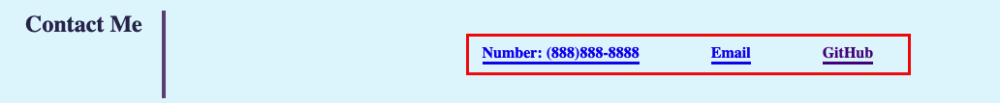
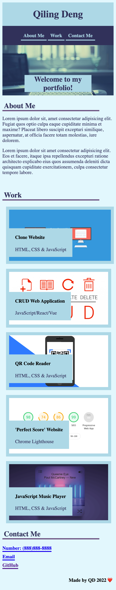
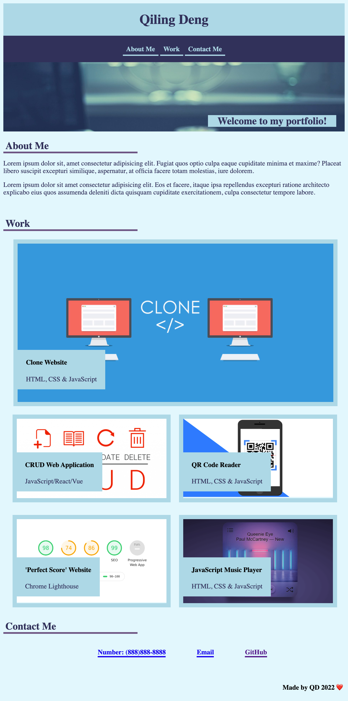
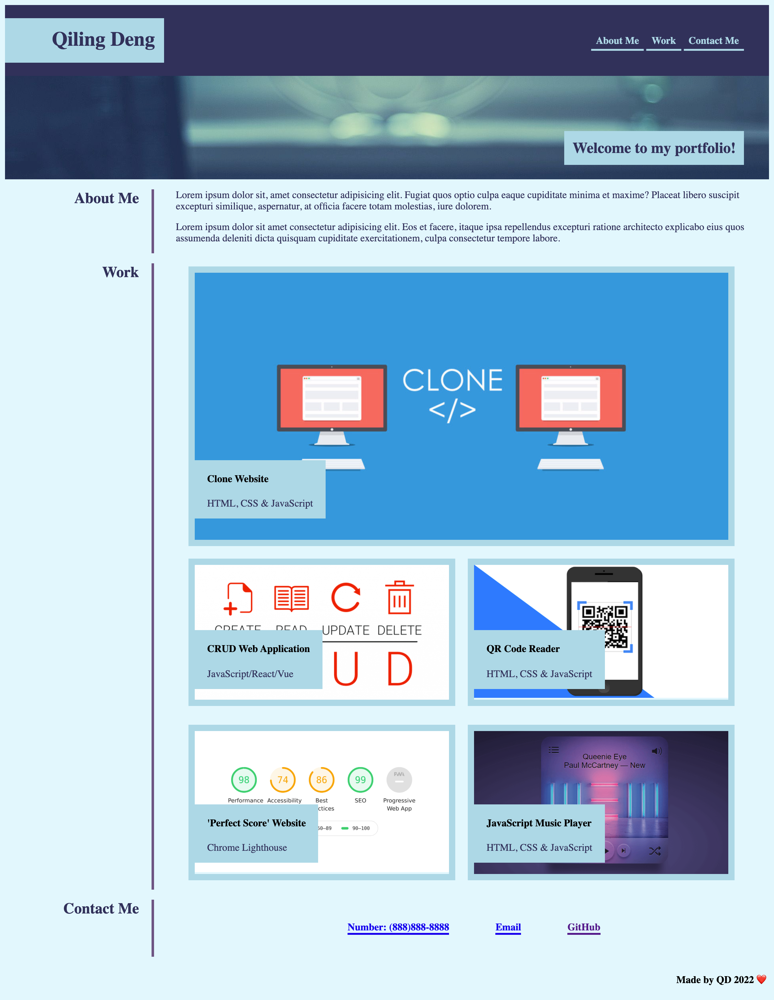

# My Portfolio Webpage

## Link 
My Portfolio Webpage: https://qd9069.github.io/my_first_portfolio/

## Table of Contents

- [Description](#description)
- [Usage](#usage)
- [Technology](#technology)
- [Assets](#assets)

## Description

```md
Welcome to my personal portfolio page!

In this webpage, you will see projects and work applications that I have been developed and deployed. 

The main purpose of this project is to build my first Portfolio Webpage and to practise my skills in HTML and CSS. This gives me a very good opptunity to practise skills such as flexbox, media queries, and the use of variables in CSS. 

I had so much fun while working on this project ❤️ 

Please feel free to reach out if you have any questions or comments regarding my portfolio webpage or other projects! 
```

## Usage

- **Navigation Bar**: Click on one of the links in the navigation, the UI will scroll to the corresponding section.

- **Work**: Click on the images of the work applications, you will be taken to that deployed application.
- **Contact Me**: 

    - Click on Phone number link to call me directly.
    - Click on Email link to send me an email.
    - CLick on the GitHub link to visit my GitHub page.

## Technology

Technologies or Skills used:

```md
- HTML
- CSS
```

## Assets

The following images demonstrate the web application's appearance and functionality:

### Mobile


### Tablet


### Desktop


---
Code originally by QD 2022 🏆


